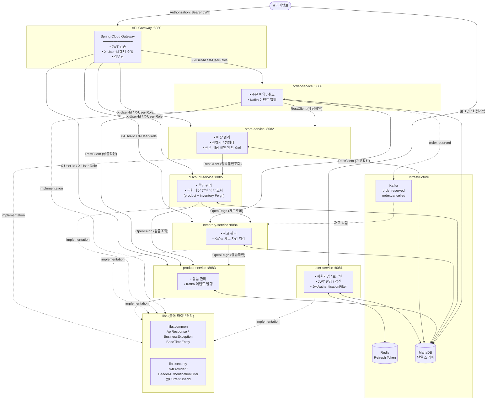

# bari-backend

MSA(Microservices Architecture) + Monorepo 구조로 구성된 Spring Boot 백엔드 프로젝트입니다.
Gradle Multi-project + Version Catalog를 사용하여 여러 서비스를 하나의 레포지토리에서 관리합니다.

---

## 기술 스택

| 분류         | 기술                                                 |
| ------------ | ---------------------------------------------------- |
| 언어         | Java 17                                              |
| 프레임워크   | Spring Boot 3.4.3                                    |
| 빌드 도구    | Gradle Multi-project + Version Catalog               |
| API Gateway  | Spring Cloud Gateway 2024.0.1 (WebFlux/Reactive)     |
| 인증/인가    | Spring Security + JWT (jjwt 0.12.6)                  |
| 데이터베이스 | MariaDB 11.4                                         |
| 캐시         | Redis 7.4                                            |
| API 문서     | springdoc-openapi 2.8.4 (Swagger UI)                 |
| 메시지 브로커 | Kafka (wurstmeister/kafka)                           |
| 서비스 간 통신 | RestClient (동기), OpenFeign (동기), Kafka (비동기) |
| 기타         | Lombok, Spring Boot Actuator, Spring Boot Validation |

---

## 프로젝트 구조

```
bari-backend/
├── settings.gradle              # 멀티 프로젝트 설정
├── build.gradle                 # 루트 빌드 설정 (공통 설정)
├── gradle/
│   └── libs.versions.toml       # Version Catalog (의존성 버전 중앙 관리)
├── docker/
│   ├── docker-compose.yml       # MariaDB, Redis, Kafka, Zookeeper
│   └── sql/
│       ├── schema.sql           # 테이블 DDL
│       └── dummy-data.sql       # 테스트용 더미 데이터
├── k8s/                         # 공통 k8s 리소스
│   ├── msa_kafka.yaml           # Kafka Deployment + Service (kafka 네임스페이스)
│   ├── msa_zookeeper.yaml       # Zookeeper Deployment + Service
│   ├── msa_redis.yaml           # Redis Deployment + Service (redis 네임스페이스)
│   └── msa_ingress.yaml         # nginx Ingress (gateway 네임스페이스)
├── .github/
│   └── workflows/
│       ├── deploy-service.yml          # 실제 빌드/배포 로직 (재사용 워크플로우)
│       └── deploy-{서비스명}.yml x 7   # 서비스별 트리거 + deploy-service.yml 호출
├── postman/
│   └── bari-backend.collection.json   # Postman 컬렉션 (전체 API)
├── libs/                        # 공유 라이브러리 모듈
│   ├── common/                  # 공통 응답/예외 처리
│   │   └── src/main/java/com/bari/common/
│   │       ├── response/        # ApiResponse, ErrorResponse
│   │       ├── exception/       # ErrorCode(interface), BusinessException, GlobalExceptionHandler
│   │       └── entity/          # BaseTimeEntity (createdAt, deletedAt, softDelete, restore)
│   └── security/                # 인증 관련 공통 모듈
│       └── src/main/java/com/bari/security/
│           ├── jwt/             # JwtTokenProvider, JwtAuthenticationFilter
│           ├── header/          # HeaderAuthenticationFilter (X-Header 방식)
│           └── annotation/      # @CurrentUserId, CurrentUserIdArgumentResolver
└── services/                    # 마이크로서비스
    ├── api-gateway/             # 단일 진입점, JWT 검증 및 라우팅 (포트: 8080)
    ├── user-service/            # 회원가입, 로그인, JWT 발급 (포트: 8081)
    ├── store-service/           # 스토어 관리, 찜하기 (포트: 8082)
    ├── product-service/         # 상품 관리 (포트: 8083)
    ├── inventory-service/       # 재고 관리 (포트: 8084)
    ├── discount-service/        # 할인 관리 (포트: 8085)
    ├── order-service/           # 주문 관리 (포트: 8086)
    └── item-service/            # X-Header 인증 방식 예시 (팀원 참고용, 포트: 8087)
```

각 서비스 내부 패키지 구조:
```
{service}/src/main/java/com/bari/{domain}/
├── controller/       # REST API 엔드포인트
├── service/          # 비즈니스 로직
├── repository/       # JPA Repository
├── entity/           # JPA 엔티티
├── dto/
│   ├── request/      # 요청 DTO
│   ├── response/     # 응답 DTO
│   └── client/       # 서비스 간 통신용 DTO
├── client/           # RestClient 기반 서비스 클라이언트
├── event/            # Kafka 이벤트 객체
├── exception/        # 서비스별 ErrorCode enum
└── config/           # 서비스별 설정
```

---

## 모듈 설명

| 모듈                         | 설명                                                             |
| ---------------------------- | ---------------------------------------------------------------- |
| `libs:common`                | 모든 서비스가 공유하는 공통 응답 형식, 예외 처리, BaseTimeEntity |
| `libs:security`              | JWT 생성/검증, 인증 필터, @CurrentUserId 어노테이션              |
| `services:api-gateway`       | 모든 외부 요청의 단일 진입점. JWT 검증 후 X-Header 주입          |
| `services:user-service`      | 회원가입, 로그인, 토큰 발급/갱신/로그아웃                        |
| `services:store-service`     | 스토어 관리, 찜하기/찜해제, 찜한 매장 할인 임박 상품 조회        |
| `services:product-service`   | 상품 등록/조회/수정/삭제, Kafka 이벤트 발행                      |
| `services:inventory-service` | 재고 등록/조회/수정/삭제, Kafka 재고 차감 처리                   |
| `services:discount-service`  | 할인 등록/조회/수정/종료, 찜한 매장 할인 임박 조회               |
| `services:order-service`     | 주문 예약/조회/상태변경, Kafka 주문 이벤트 발행                  |
| `services:item-service`      | X-Header 인증 방식 사용 예시 (팀원 참고용)                       |

---

## 서비스별 포트

| 서비스            | 로컬 포트    | k8s 컨테이너 포트 | 설명                                  |
| ----------------- | ------------ | ----------------- | ------------------------------------- |
| api-gateway       | 8080         | 8080              | 단일 진입점 (모든 외부 요청은 여기로) |
| user-service      | 8081         | 8081              | 사용자 인증 서비스                    |
| store-service     | 8082         | 8082              | 스토어 서비스                         |
| product-service   | 8083         | 8083              | 상품 서비스                           |
| inventory-service | 8084         | 8084              | 재고 서비스                           |
| discount-service  | 8085         | 8085              | 할인 서비스                           |
| order-service     | 8086         | 8086              | 주문 서비스                           |
| item-service      | 8087         | -                  | 아이템 서비스 (팀원 예시, k8s 미배포) |
| MariaDB           | 3306         | -                 | 데이터베이스                          |
| Redis             | 6379         | -                 | Refresh Token 저장소                  |
| Kafka             | 9092         | -                 | 메시지 브로커                         |

---

## 서비스 간 통신

### 동기 통신 (RestClient / OpenFeign)

| 호출 서비스       | 피호출 서비스     | 방식        | 용도                                    |
| ----------------- | ----------------- | ----------- | --------------------------------------- |
| order-service     | store-service     | RestClient  | 매장 존재 확인                          |
| order-service     | product-service   | RestClient  | 상품 존재 확인                          |
| order-service     | inventory-service | RestClient  | 재고 수량 확인                          |
| store-service     | discount-service  | RestClient  | 찜한 매장 할인 임박 상품 조회           |
| discount-service  | inventory-service | OpenFeign   | 재고 존재 확인, 재고 목록 조회          |
| discount-service  | product-service   | OpenFeign   | 매장별 상품 목록 조회                   |
| inventory-service | product-service   | OpenFeign   | 상품 존재 확인                          |

### 비동기 통신 (Kafka)

| Topic             | Producer         | Consumer          | 용도                |
| ----------------- | ---------------- | ----------------- | ------------------- |
| `order.reserved`  | order-service    | inventory-service | 주문 예약 시 재고 차감 |
| `order.cancelled` | order-service    | -                 | 주문 취소 이벤트    |

### 내부 전용 API (서비스 간 직접 호출, api-gateway 라우팅 없음)

| 경로                                        | 서비스            | 설명                        |
| ------------------------------------------- | ----------------- | --------------------------- |
| `GET /api/internal/stores/{storeId}`        | store-service     | 매장 단건 조회              |
| `GET /api/internal/products/{productId}`    | product-service   | 상품 단건 조회              |
| `GET /api/internal/products/by-stores`      | product-service   | 매장별 상품 목록 조회       |
| `GET /api/internal/inventories/by-products` | inventory-service | 상품별 재고 목록 조회       |
| `GET /api/internal/discounts/expiring`      | discount-service  | 찜한 매장 할인 임박 상품 조회 |
| `GET /api/store/inventory/exists/{id}`      | inventory-service | 재고 존재 확인              |

---

## 로컬 개발 환경 설정

### 사전 요구사항

- **Java 17** (JDK)
- **Docker** 및 **Docker Compose**
- (선택) IntelliJ IDEA 또는 VS Code

### 0. 환경변수 파일(.env) 준비

민감한 값(DB 비밀번호, JWT 시크릿 등)은 git에 커밋되지 않는 `.env` 파일로 관리합니다.
최초 1회만 아래처럼 템플릿을 복사해서 값을 채워주면 됩니다 (기본값 그대로 써도 로컬 실행에는 문제없습니다).

```bash
# 서비스(gradlew bootRun)용 - 저장소 루트에 위치
cp .env.example .env

# docker-compose 인프라(MariaDB, RabbitMQ)용
cp docker/.env.example docker/.env
```

두 파일 모두 `.gitignore`에 의해 git에 커밋되지 않습니다. `.env`의 값은 `./gradlew bootRun` 실행 시 자동으로 각 서비스의 환경변수로 주입되고, `docker/.env`의 값은 `docker compose` 실행 시 자동으로 반영됩니다.

### 1. Docker 인프라 실행

```bash
# MariaDB, Redis, Kafka, Zookeeper 실행
docker compose -f docker/docker-compose.yml up -d

# 실행 상태 확인
docker compose -f docker/docker-compose.yml ps

# MariaDB 접속 확인
docker exec -it bari-mariadb mariadb -u bari -pbari1234 bari
```

처음 실행 시 `docker/sql/schema.sql`과 `docker/sql/dummy-data.sql`이 자동으로 적용됩니다.

### DB 초기화 (스키마/더미데이터 변경 시)

```bash
# 컨테이너 + 볼륨 전체 삭제 (DB 데이터 완전 초기화)
docker compose -f docker/docker-compose.yml down -v

# 다시 실행 (schema.sql + dummy-data.sql 자동 적용)
docker compose -f docker/docker-compose.yml up -d
```

| 명령어    | 데이터   | SQL 재실행 | 사용 시점          |
| --------- | -------- | ---------- | ------------------ |
| `down`    | 유지     | X          | 단순 재시작        |
| `down -v` | **삭제** | **O**      | SQL 변경 후 초기화 |

### 2. 서비스 실행

각 서비스를 별도 터미널에서 실행합니다:

```bash
./gradlew :services:api-gateway:bootRun       # 포트: 8080
./gradlew :services:user-service:bootRun      # 포트: 8081
./gradlew :services:store-service:bootRun     # 포트: 8082
./gradlew :services:product-service:bootRun   # 포트: 8083
./gradlew :services:inventory-service:bootRun # 포트: 8084
./gradlew :services:discount-service:bootRun  # 포트: 8085
./gradlew :services:order-service:bootRun     # 포트: 8086
```

### 3. 빌드

```bash
# 전체 빌드
./gradlew build

# 특정 서비스만 빌드
./gradlew :services:order-service:build

# bootJar (Docker 이미지 빌드용)
./gradlew :services:order-service:bootJar -x test
```

---

## 인증 방식 설명

### JWT 발급 (user-service)

클라이언트는 로그인 시 user-service로부터 JWT Access Token과 Refresh Token을 발급받습니다.

```
클라이언트 → POST /api/auth/login → user-service(8081)
     ← { accessToken, refreshToken, userId, role }
```

- **Access Token**: 1시간 유효, 모든 API 요청 시 사용
- **Refresh Token**: 7일 유효, Redis에 저장(`refresh:{userId}`), Access Token 만료 시 갱신용

### api-gateway를 통한 X-Header 방식

모든 외부 요청은 api-gateway(8080)를 통해 들어옵니다:

```
1. 클라이언트 → api-gateway:8080 (Authorization: Bearer {JWT})
2. JwtGatewayFilter가 JWT 검증
3. 검증 성공 → X-User-Id: {userId}, X-User-Role: {role} 헤더 추가
4. 해당 서비스로 전달
5. 각 서비스는 HeaderAuthenticationFilter로 헤더를 읽어 SecurityContext 설정
```

### 직접 서비스 호출 시 (로컬 개발/테스트)

api-gateway를 거치지 않고 직접 서비스를 호출할 때는 X-User-Id, X-User-Role 헤더를 수동으로 설정합니다:

```bash
curl -H "X-User-Id: 1" -H "X-User-Role: USER" http://localhost:8082/api/stores
```

---

## 주요 API

### 인증

| 메서드 | 경로                    | 설명              |
| ------ | ----------------------- | ----------------- |
| POST   | `/api/auth/signup`      | 회원가입          |
| POST   | `/api/auth/login`       | 로그인 (JWT 발급) |
| POST   | `/api/auth/refresh`     | 토큰 갱신         |
| POST   | `/api/auth/logout`      | 로그아웃          |
| GET    | `/api/users/me`         | 내 정보 조회      |

### 매장 (store-service)

| 메서드 | 경로                              | 권한  | 설명                              |
| ------ | --------------------------------- | ----- | --------------------------------- |
| GET    | `/api/stores`                     | -     | 매장 목록 조회                    |
| GET    | `/api/stores/{id}`                | -     | 매장 상세 조회                    |
| POST   | `/api/stores`                     | OWNER | 매장 등록                         |
| PUT    | `/api/stores/{id}`                | OWNER | 매장 수정                         |
| DELETE | `/api/stores/{id}`                | OWNER | 매장 삭제                         |
| POST   | `/api/stores/{id}/favorite`       | USER  | 찜하기 / 찜해제 토글              |
| GET    | `/api/stores/favorites`           | USER  | 찜한 매장 목록 조회               |
| GET    | `/api/stores/favorites/discounts` | USER  | 찜한 매장 할인 임박 상품 (홈화면) |

### 상품 (product-service)

| 메서드 | 경로                  | 권한  | 설명           |
| ------ | --------------------- | ----- | -------------- |
| GET    | `/api/products`       | -     | 상품 목록 조회 |
| GET    | `/api/products/{id}`  | -     | 상품 상세 조회 |
| POST   | `/api/products`       | OWNER | 상품 등록      |
| PUT    | `/api/products/{id}`  | OWNER | 상품 수정      |
| DELETE | `/api/products/{id}`  | OWNER | 상품 삭제      |

### 재고 (inventory-service)

| 메서드 | 경로                                 | 설명                  |
| ------ | ------------------------------------ | --------------------- |
| POST   | `/api/store/inventory`               | 재고 등록             |
| GET    | `/api/store/inventory/product/{id}`  | 상품별 재고 조회      |
| PUT    | `/api/store/inventory/{id}`          | 재고 수정             |
| DELETE | `/api/store/inventory/{id}`          | 재고 삭제             |
| GET    | `/api/store/inventory/near-expire`   | 유통기한 임박 재고 조회 |

### 할인 (discount-service)

| 메서드 | 경로                               | 설명           |
| ------ | ---------------------------------- | -------------- |
| POST   | `/api/store/discounts`             | 할인 등록      |
| GET    | `/api/store/discounts/{inventoryId}` | 재고별 할인 조회 |
| PUT    | `/api/store/discounts/{id}`        | 할인 수정      |
| DELETE | `/api/store/discounts/{id}`        | 할인 종료      |

### 주문 (order-service)

| 메서드 | 경로                                    | 권한  | 설명              |
| ------ | --------------------------------------- | ----- | ----------------- |
| POST   | `/api/orders`                           | USER  | 주문 예약         |
| GET    | `/api/orders`                           | USER  | 내 주문 목록 조회 |
| GET    | `/api/orders/{id}`                      | USER  | 주문 상세 조회    |
| DELETE | `/api/orders/{id}`                      | USER  | 주문 취소         |
| GET    | `/api/orders/store`                     | OWNER | 매장 주문 목록    |
| PATCH  | `/api/orders/store/{id}/status`         | OWNER | 주문 상태 변경    |

---

## Swagger UI

각 서비스가 실행 중이면 아래 URL에서 API 문서를 확인할 수 있습니다:

| 서비스            | URL                                     |
| ----------------- | --------------------------------------- |
| user-service      | http://localhost:8081/swagger-ui.html   |
| store-service     | http://localhost:8082/swagger-ui.html   |
| product-service   | http://localhost:8083/swagger-ui.html   |
| inventory-service | http://localhost:8084/swagger-ui.html   |
| discount-service  | http://localhost:8085/swagger-ui.html   |
| order-service     | http://localhost:8086/swagger-ui.html   |

---

## k8s 배포

아래는 **클러스터를 처음부터 세팅할 때 손으로 하는 수동 배포 절차**다. 최초 1회 인프라 구축이나 트러블슈팅 시 이 순서를 그대로 따라가면 된다.
이후 코드 변경에 따른 반복 배포는 [CI/CD (GitHub Actions)](#cicd-github-actions) 섹션의 자동화가 대신 처리한다.

### 0. 배포 전 인프라 전제조건

k8s 매니페스트만으로는 안 되고, 아래가 이미 준비되어 있어야 한다:

- **EKS 클러스터** (`aws eks update-kubeconfig`로 로컬 kubectl 연결)
- **ECR 리포지토리** 7개 (서비스별 1개, `260956700310.dkr.ecr.ap-northeast-2.amazonaws.com/{서비스명}`)
- **RDS(MariaDB)** — 각 네임스페이스의 `bari-app-secrets`가 가리키는 인스턴스
- **nginx ingress controller** (Helm 차트 `ingress-nginx/ingress-nginx`) — [msa_ingress.yaml](k8s/msa_ingress.yaml)의 `ingressClassName: nginx`를 실제로 처리해주는 컨트롤러. `controller.service.type=LoadBalancer` + `service.beta.kubernetes.io/aws-load-balancer-type: nlb` 어노테이션으로 설치하면 이 컨트롤러 앞단에 AWS NLB가 자동 생성된다. 이게 없으면 Ingress를 apply해도 아무 로드밸런서도 생기지 않는다.
- **워커 노드 보안그룹** — NLB → 노드 NodePort로 트래픽이 전달되므로, 노드 보안그룹에 NodePort 대역(`30000-32767`) 인바운드가 열려있어야 한다.

### 네임스페이스 구성

각 서비스는 독립된 네임스페이스를 사용하며, 서비스별 `*-depl.yaml`(또는 `*-depl.yml`)에 `Namespace` 리소스가 같이 정의되어 있어 apply 시 자동 생성된다.

```
gateway / user-service / store-service / product-service
inventory-service / discount-service / order-service / kafka / redis
```

### 1. 이미지 빌드 & ECR 푸시

각 서비스 `Dockerfile`은 gradle 빌드 → jre-alpine 실행의 멀티스테이지 빌드로 되어 있다. 리포지토리 루트에서 서비스별로 반복:

```bash
aws ecr get-login-password --region ap-northeast-2 \
  | docker login --username AWS --password-stdin 260956700310.dkr.ecr.ap-northeast-2.amazonaws.com

docker build -f services/user-service/Dockerfile \
  -t 260956700310.dkr.ecr.ap-northeast-2.amazonaws.com/user-service:latest .
docker push 260956700310.dkr.ecr.ap-northeast-2.amazonaws.com/user-service:latest
```

`api-gateway, store-service, product-service, inventory-service, discount-service, order-service`도 동일하게 반복한다.
(`item-service`는 k8s 매니페스트가 없는 팀원 예시 코드라 배포 대상이 아니다.)

### 2. 공통 인프라 배포

```bash
kubectl apply -f k8s/msa_zookeeper.yaml   # kafka 네임스페이스 생성 + Zookeeper
kubectl apply -f k8s/msa_kafka.yaml       # zookeeper.kafka.svc.cluster.local 에 의존
kubectl apply -f k8s/msa_redis.yaml       # redis 네임스페이스
```

Ingress(nginx)는 api-gateway가 떠 있어야 의미가 있으므로 맨 마지막(5번)에 적용한다.

### 3. ⚠️ 공통 Secret(`bari-app-secrets`) 수동 생성 — git에 없는 부분

7개 서비스 전부 `bari-app-secrets`라는 **동일한 이름**의 Secret을 참조한다(DB 자격증명·JWT 서명키를 git에 올리지 않기 위해, 이 Secret을 만드는 yaml은 레포에 커밋되어 있지 않다). Secret은 네임스페이스 스코프라 **7개 네임스페이스 각각에** 만들어야 하고, 서비스마다 참조하는 키가 다르므로(내부 서비스 디스커버리용 `_HOST`/`_PORT`, Kafka 부트스트랩 주소가 서비스별로 다름) 네임스페이스별로 넣는 값도 다르다. 안 만들면 Pod가 `CreateContainerConfigError`로 멈춘다.

```bash
# 공통값
ENDPOINT='<RDS 엔드포인트>'
DB_PW='<RDS 비밀번호>'
JWT='bari-super-secret-key-must-be-at-least-32-chars'

# user-service, product-service — DB + JWT만
for ns in user-service product-service; do
  kubectl create namespace "$ns" --dry-run=client -o yaml | kubectl apply -f -
  kubectl create secret generic bari-app-secrets -n "$ns" \
    --from-literal=DB_HOST="$ENDPOINT" --from-literal=DB_PORT=3306 \
    --from-literal=DB_NAME=bari --from-literal=DB_USERNAME=bari \
    --from-literal=DB_PASSWORD="$DB_PW" --from-literal=JWT_SECRET="$JWT"
done

# store-service — DB + JWT + discount-service 참조
kubectl create namespace store-service --dry-run=client -o yaml | kubectl apply -f -
kubectl create secret generic bari-app-secrets -n store-service \
  --from-literal=DB_HOST="$ENDPOINT" --from-literal=DB_PORT=3306 \
  --from-literal=DB_NAME=bari --from-literal=DB_USERNAME=bari \
  --from-literal=DB_PASSWORD="$DB_PW" --from-literal=JWT_SECRET="$JWT" \
  --from-literal=DISCOUNT_SERVICE_HOST=discount-service.discount-service.svc.cluster.local \
  --from-literal=DISCOUNT_SERVICE_PORT=8085

# inventory-service — DB + JWT + Kafka + product-service 참조
kubectl create namespace inventory-service --dry-run=client -o yaml | kubectl apply -f -
kubectl create secret generic bari-app-secrets -n inventory-service \
  --from-literal=DB_HOST="$ENDPOINT" --from-literal=DB_PORT=3306 \
  --from-literal=DB_NAME=bari --from-literal=DB_USERNAME=bari \
  --from-literal=DB_PASSWORD="$DB_PW" --from-literal=JWT_SECRET="$JWT" \
  --from-literal=KAFKA_BOOTSTRAP_SERVERS=kafka.kafka.svc.cluster.local:9092 \
  --from-literal=PRODUCT_SERVICE_HOST=product-service.product-service.svc.cluster.local \
  --from-literal=PRODUCT_SERVICE_PORT=8083

# discount-service — DB + JWT + product/inventory/store 참조
kubectl create namespace discount-service --dry-run=client -o yaml | kubectl apply -f -
kubectl create secret generic bari-app-secrets -n discount-service \
  --from-literal=DB_HOST="$ENDPOINT" --from-literal=DB_PORT=3306 \
  --from-literal=DB_NAME=bari --from-literal=DB_USERNAME=bari \
  --from-literal=DB_PASSWORD="$DB_PW" --from-literal=JWT_SECRET="$JWT" \
  --from-literal=PRODUCT_SERVICE_HOST=product-service.product-service.svc.cluster.local \
  --from-literal=PRODUCT_SERVICE_PORT=8083 \
  --from-literal=INVENTORY_SERVICE_HOST=inventory-service.inventory-service.svc.cluster.local \
  --from-literal=INVENTORY_SERVICE_PORT=8084 \
  --from-literal=STORE_SERVICE_HOST=store-service.store-service.svc.cluster.local \
  --from-literal=STORE_SERVICE_PORT=8082

# order-service — DB + JWT + Kafka + store/product/inventory/discount 참조
kubectl create namespace order-service --dry-run=client -o yaml | kubectl apply -f -
kubectl create secret generic bari-app-secrets -n order-service \
  --from-literal=DB_HOST="$ENDPOINT" --from-literal=DB_PORT=3306 \
  --from-literal=DB_NAME=bari --from-literal=DB_USERNAME=bari \
  --from-literal=DB_PASSWORD="$DB_PW" --from-literal=JWT_SECRET="$JWT" \
  --from-literal=KAFKA_BOOTSTRAP_SERVERS=kafka.kafka.svc.cluster.local:9092 \
  --from-literal=STORE_SERVICE_HOST=store-service.store-service.svc.cluster.local \
  --from-literal=STORE_SERVICE_PORT=8082 \
  --from-literal=PRODUCT_SERVICE_HOST=product-service.product-service.svc.cluster.local \
  --from-literal=PRODUCT_SERVICE_PORT=8083 \
  --from-literal=INVENTORY_SERVICE_HOST=inventory-service.inventory-service.svc.cluster.local \
  --from-literal=INVENTORY_SERVICE_PORT=8084 \
  --from-literal=DISCOUNT_SERVICE_HOST=discount-service.discount-service.svc.cluster.local \
  --from-literal=DISCOUNT_SERVICE_PORT=8085

# gateway — JWT만(DB 접근 없음) + 6개 서비스 전부 참조
kubectl create namespace gateway --dry-run=client -o yaml | kubectl apply -f -
kubectl create secret generic bari-app-secrets -n gateway \
  --from-literal=JWT_SECRET="$JWT" \
  --from-literal=STORE_SERVICE_HOST=store-service.store-service.svc.cluster.local \
  --from-literal=STORE_SERVICE_PORT=8082 \
  --from-literal=PRODUCT_SERVICE_HOST=product-service.product-service.svc.cluster.local \
  --from-literal=PRODUCT_SERVICE_PORT=8083 \
  --from-literal=INVENTORY_SERVICE_HOST=inventory-service.inventory-service.svc.cluster.local \
  --from-literal=INVENTORY_SERVICE_PORT=8084 \
  --from-literal=USER_SERVICE_HOST=user-service.user-service.svc.cluster.local \
  --from-literal=USER_SERVICE_PORT=8081 \
  --from-literal=DISCOUNT_SERVICE_HOST=discount-service.discount-service.svc.cluster.local \
  --from-literal=DISCOUNT_SERVICE_PORT=8085 \
  --from-literal=ORDER_SERVICE_HOST=order-service.order-service.svc.cluster.local \
  --from-literal=ORDER_SERVICE_PORT=8086
```

`kubectl create secret`은 멱등하지 않으므로, 값을 잘못 넣어 재실행해야 하면 `kubectl delete secret bari-app-secrets -n <네임스페이스>`로 먼저 지우고 다시 만든다.

### 4. 서비스 배포 (의존관계 순서)

서비스 간 RestClient/OpenFeign 호출 대상이 먼저 떠 있도록 아래 순서로 apply한다. `bari-app-secrets`는 3번에서 이미 네임스페이스별로 만들어 둔 상태이므로, 여기서는 `Deployment → Service` 순으로만 적용한다.

```bash
# 4-1) user-service — 다른 서비스에 의존하지 않음
kubectl apply -f services/user-service/k8s/user-depl.yaml
kubectl apply -f services/user-service/k8s/user-service.yaml

# 4-2) product-service — bari-app-secrets만 사용(envFrom), 다른 의존 없음
kubectl apply -f services/product-service/k8s/product-depl.yaml
kubectl apply -f services/product-service/k8s/product-service.yaml

# 4-3) store-service, inventory-service — product-service를 참조
kubectl apply -f services/store-service/k8s/store-depl.yaml
kubectl apply -f services/store-service/k8s/store-service.yaml

kubectl apply -f services/inventory-service/k8s/inventory-depl.yml
kubectl apply -f services/inventory-service/k8s/inventory-service.yml

# 4-4) discount-service — product, inventory, store를 참조
kubectl apply -f services/discount-service/k8s/discount-depl.yml
kubectl apply -f services/discount-service/k8s/discount-service.yml

# 4-5) order-service — store, product, inventory, discount를 모두 참조
kubectl apply -f services/order-service/k8s/order-depl.yml
kubectl apply -f services/order-service/k8s/order-service.yml

# 4-6) api-gateway — 전 서비스의 단일 진입점, 항상 마지막
kubectl apply -f services/api-gateway/k8s/apigateway-depl.yaml
kubectl apply -f services/api-gateway/k8s/apigateway-service.yaml
```

### 5. Ingress(nginx) 연결

```bash
kubectl apply -f k8s/msa_ingress.yaml
```

`gateway` 네임스페이스에 `api-gateway` Service가 이미 있어야 라우팅이 성립하므로, 4-6번 이후에 적용한다. nginx ingress controller는 Ingress마다 새 로드밸런서를 만들지 않고, 컨트롤러 설치 시 이미 떠 있는 하나의 NLB를 재사용한다.

### 6. 배포 확인

```bash
kubectl get pods -A                                # 전체 네임스페이스 Pod 상태 확인
kubectl get ingress -n gateway                      # LoadBalancer 주소(ADDRESS) 확인
kubectl logs -n order-service -l app=order-service  # 서비스별 로그
kubectl describe pod -n user-service <pod-name>     # CreateContainerConfigError 등 트러블슈팅
```

주소가 뜨면 외부에서 헬스체크:

```bash
curl http://<LoadBalancer 주소>/actuator/health
```

### 서비스 간 k8s DNS

```
{서비스명}.{네임스페이스}.svc.cluster.local
예: order-service.order-service.svc.cluster.local
    kafka.kafka.svc.cluster.local
```

각 네임스페이스의 `bari-app-secrets`에 다른 서비스의 `_HOST`/`_PORT`가 이 DNS 규칙으로 미리 박혀 있다.

---

## CI/CD (GitHub Actions)

위 "k8s 배포"의 수동 절차 중 **이미지 빌드 → ECR 푸시 → 클러스터에 새 이미지 반영** 세 단계를 `dev` 브랜치 push에 맞춰 자동화한 것이다.
Secret 생성(3번)이나 최초 Deployment/Service 적용(4~5번) 같은 "인프라를 처음 만드는" 작업은 CI/CD 대상이 아니며 여전히 수동이다. CI/CD는 어디까지나 **이미 떠 있는 Deployment의 이미지를 새 버전으로 교체**하는 역할만 한다.

### 동작 방식

```
services/order-service/** 변경분을 dev 브랜치에 push
        │
        ▼  (경로 필터에 걸려서 deploy-order-service.yml 만 실행됨)
[1] 소스 체크아웃
[2] AWS 자격 증명 설정 (Secrets: AWS_ACCESS_KEY_ID / AWS_SECRET_ACCESS_KEY)
[3] ECR 로그인
[4] Docker 이미지 빌드 (services/order-service/Dockerfile 그대로 사용)
[5] ECR에 푸시 — :latest 태그와 :{커밋SHA} 태그 두 개
[6] EKS에 kubeconfig 연결 (Secrets: EKS_CLUSTER_NAME)
[7] kubectl set image deployment/order-service order-service=<이미지>:{커밋SHA} -n order-service
[8] kubectl rollout status 로 롤링 업데이트 성공 여부 확인
```

- `latest`가 아니라 **커밋 SHA 태그로 배포**한다. `latest`만 믿고 재배포를 트리거하면 "재배포했는데 이전 이미지가 그대로 떠 있는" 문제가 생길 수 있어서, 이번에 빌드한 이미지를 정확히 지정해 배포한다. (`:latest` 태그는 디버깅 시 `docker pull ...:latest`로 최신 이미지를 바로 당겨보기 편하도록 같이 남겨둔다.)
- 서비스마다 `paths:` 필터가 걸려 있어 **자기 서비스 코드가 바뀔 때만** 해당 워크플로우가 실행된다. 단, 모든 서비스가 공유하는 `libs/**`(공통 응답/예외/JWT)가 바뀌면 7개 서비스 워크플로우가 전부 실행된다.

### 파일 구성

```
.github/workflows/
├── deploy-service.yml            # 실제 빌드/배포 로직이 담긴 재사용 워크플로우 (workflow_call)
├── deploy-api-gateway.yml        # 트리거 + deploy-service.yml 호출 (namespace: gateway)
├── deploy-user-service.yml       # 〃                              (namespace: user-service)
├── deploy-store-service.yml      # 〃                              (namespace: store-service)
├── deploy-product-service.yml    # 〃                              (namespace: product-service)
├── deploy-inventory-service.yml  # 〃                              (namespace: inventory-service)
├── deploy-discount-service.yml   # 〃                              (namespace: discount-service)
└── deploy-order-service.yml      # 〃                              (namespace: order-service)
```

7개 서비스의 빌드/배포 절차가 완전히 동일(이름과 네임스페이스만 다름)하기 때문에, 실제 로직은 `deploy-service.yml` 하나에만 두고 나머지 7개는 "언제 실행할지"와 "어떤 서비스인지"만 짧게 지정해 재사용 워크플로우를 호출한다. 각 파일은 `workflow_dispatch`도 열어 두어서 GitHub Actions 탭에서 수동으로도 재실행할 수 있다.

### ⚠️ 최초 1회 GitHub 설정 (코드로 대신할 수 없는 부분)

워크플로우 파일만으로는 동작하지 않는다. 저장소의 `Settings → Secrets and variables → Actions`에 아래 3개를 등록해야 CI가 AWS에 접근할 수 있다.

| Secret 이름 | 값 | 용도 |
| --- | --- | --- |
| `AWS_ACCESS_KEY_ID` | ECR push + EKS 배포 권한이 있는 IAM 사용자의 액세스 키 | AWS 인증 |
| `AWS_SECRET_ACCESS_KEY` | 위 IAM 사용자의 시크릿 키 | AWS 인증 |
| `EKS_CLUSTER_NAME` | 실제 EKS 클러스터 이름 | `aws eks update-kubeconfig`에 사용 |

해당 IAM 사용자는 최소한 `ecr:GetAuthorizationToken`/`ecr:BatchCheckLayerAvailability`/`ecr:PutImage` 등 ECR 푸시 권한과, EKS 클러스터의 aws-auth ConfigMap에 등록되어 `kubectl` 명령을 수행할 수 있는 권한이 있어야 한다.

### 배포 확인 / 롤백

```bash
# Actions 탭 대신 CLI로 롤아웃 이력 확인
kubectl rollout history deployment/order-service -n order-service

# 방금 배포가 잘못됐다면 직전 버전으로 롤백
kubectl rollout undo deployment/order-service -n order-service
```

---

## 더미 데이터 계정

로컬 개발 시 아래 계정으로 바로 테스트할 수 있습니다 (비밀번호: `p1234`):

| 이메일          | 권한  | 설명          |
| --------------- | ----- | ------------- |
| admin@bari.com  | ADMIN | 시스템 관리자 |
| owner1@bari.com | OWNER | 가게 사장님   |
| user1@bari.com  | USER  | 일반 사용자   |

---

## 헬스체크

```bash
curl http://localhost:8080/actuator/health  # api-gateway
curl http://localhost:8081/actuator/health  # user-service
curl http://localhost:8082/actuator/health  # store-service
curl http://localhost:8083/actuator/health  # product-service
curl http://localhost:8084/actuator/health  # inventory-service
curl http://localhost:8085/actuator/health  # discount-service
curl http://localhost:8086/actuator/health  # order-service
```

---

## 아키텍처 다이어그램


